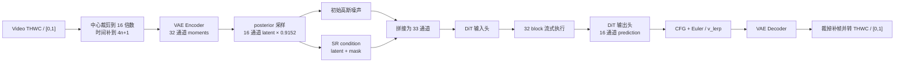

# SeedVR2 NCNN Runtime

本仓库把 SeedVR2 3B 超分推理拆成可验证的 NCNN 子图与六个动态自定义层，并提供一个
对外只暴露 `SeedVR2Engine` 的 C++ Runtime。当前 CPU 路径已经能够执行动态 VAE、
32 层流式 DiT、CFG、Euler sampler 和视频后处理；Vulkan 资源边界已经建立，但在六个
自定义层实现 `forward_vkcompute` 之前会明确返回 `UnsupportedBackend`。

## 当前状态

| 模块 | CPU | 动态 T/H/W | Vulkan |
| --- | --- | --- | --- |
| 视频预处理/后处理 | 已完成 | 已完成 | CPU 调度逻辑，无需 shader |
| VAE Encoder/Decoder | 已完成 | 已完成 | 原生层待验证，自定义层待实现 |
| DiT 输入头 | 已完成 | 已完成 | 自定义层待实现 |
| 32 个 DiT block | 已完成 | 已完成 | 自定义窗口 attention 等待实现 |
| DiT 输出头 | 已完成 | 已完成 | 自定义层待实现 |
| CFG + Euler sampler | 已完成 | 已完成 | 当前 CPU 标量实现 |
| `SeedVR2Engine` Facade | 已完成 | 已完成 | 后端能力闸门已完成 |

这里的“动态”表示同一份 param/bin 可以处理模型约束内的不同 `T,H,W`，不是为导出样例
硬编码输入尺寸。当前正式目标仍是 batch=1、SeedVR2 3B、SR 任务和预计算文本 embedding。

## 推理流程



一层 DiT block 的权重完成 forward 后立即随局部 `ncnn::Net` 释放。输入头、输出头、
VAE encoder 和 decoder 由组件对象管理，不需要测试 runner 参与正式调度。

## 目录职责

```text
include/seedvr2/engine.h
    唯一公开 API；定义 RuntimeOptions、Video、TextEmbedding 和 SeedVR2Engine。

src/engine.cpp
    Facade/PIMPL；编排完整推理事务并聚合错误信息。
src/vae.cpp
    动态 VAE 加载、posterior 采样、latent scaling 和 encode/decode。
src/dit.cpp
    DiT 输入头、32 block 流式执行和输出头。
src/sampler.cpp
    CFG、CFG rescale、lerp schedule 与 Euler/v_lerp 更新。
src/preprocessing.cpp
    THWC 到 C,T,H,W、中心裁剪、归一化和 4n+1 补帧。
src/postprocessing.cpp
    decoder 输出限幅、裁帧和 C,T,H,W 到 THWC。
src/vulkan_context.cpp
    NCNN Option、线程/精度配置、Vulkan 生命周期和能力闸门。

apps/seedvr2_cli.cpp
    正式命令行入口；当前使用 FP32 raw 文件协议，核心库不绑定媒体编解码器。

tests/*_runner.cpp
    PyTorch/NCNN 分层对齐入口，不属于正式 Runtime。
tests/runtime_unit_test.cpp
    无大权重的布局、预处理、后处理、CFG 和 Euler 快速测试。

custom_layers/
    六个已完成 CPU forward 的 SeedVR2 动态层；下一阶段在这里增加 Vulkan 实现。

tools/
    PyTorch reference dump、param/bin 导出和数值对齐脚本。
docs/
    转换报告、VAE 报告和六个自定义层的详细输入输出/实现报告。
```

采用的主要结构模式：

- **Facade**：调用方只使用 `SeedVR2Engine::load/process`。
- **PIMPL**：公开头文件不包含 `net.h`，NCNN 不进入业务 ABI。
- **Strategy**：Euler sampler 是独立模块，后续可替换其他采样策略。
- **RAII**：`ncnn::Net`、Vulkan 实例和模型组件由对象生命周期管理。
- **Streaming execution**：DiT block 是执行计划的一部分，不是 32 个常驻对象。

## 公开数据契约

### Video

- 布局：连续 `T,H,W,C`。
- 类型：FP32。
- 输入范围：`[0,1]`。
- 通道：当前必须为 RGB，即 `C=3`。
- 空间：Engine 中心裁剪到 16 的倍数，不做隐藏缩放。
- 时间：`T>1` 时复制最后一帧到 `(T-1)%4==0`，输出再裁回原帧数。

### TextEmbedding

- 布局：连续 `[tokens,5120]`。
- 类型：FP32。
- positive 必须提供；`cfg_scale != 1` 时 negative 也必须提供。
- 当前不集成文本编码器，默认使用 PyTorch 项目提供的 `pos_emb.pt/neg_emb.pt` 导出数据。

### 内部张量

- VAE：NCNN `Mat(w=W,h=H,d=T,c=C)`，逻辑写作 `[C,T,H,W]`。
- DiT public component：输入 `[33,T,H,W]`，输出 `[16,T,H,W]`。
- DiT NCNN 子图：运行前展平为 `[T*H*W,C]`，输出后再恢复 4D。
- 文本：NCNN 2D Mat 的 `w=5120,h=tokens`。

## 模型目录

`SeedVR2Engine::load("ncnn_models")` 默认识别下面的目录：

```text
ncnn_models/
  vae_dynamic/
    seedvr2_vae_encoder_dynamic.ncnn.param
    seedvr2_vae_encoder_dynamic.ncnn.bin
    seedvr2_vae_decoder_dynamic.ncnn.param
    seedvr2_vae_decoder_dynamic.ncnn.bin
  dit_full_fp16/
    seedvr2_dit_input.ncnn.param
    seedvr2_dit_input.ncnn.bin
    seedvr2_dit_block_00.ncnn.param
    seedvr2_dit_block_00.ncnn.bin
    ...
    seedvr2_dit_block_31.ncnn.param
    seedvr2_dit_block_31.ncnn.bin
    seedvr2_dit_output.ncnn.param
    seedvr2_dit_output.ncnn.bin
```

模型和测试向量体积很大，受 `.gitignore` 管理，不应提交到 GitHub。仓库只提交代码、
导出工具、校验和清单生成逻辑和报告。

## 构建

当前本机环境：

- WSL2 Ubuntu 24.04
- GCC 13.3.0
- CMake 3.28.3
- 本地 NCNN `1.0.20260722`
- 24 个逻辑 CPU
- `NCNN_SOURCE_DIR=/home/czw1/ncnn_learn/ncnn`
- 当前构建 `SEEDVR2_ENABLE_VULKAN=OFF`

```bash
cd /home/czw1/ncnn_learn/seedvr2_ncnn
cmake -S . -B build \
  -DCMAKE_BUILD_TYPE=Release \
  -DNCNN_SOURCE_DIR=/home/czw1/ncnn_learn/ncnn \
  -DSEEDVR2_ENABLE_VULKAN=OFF
cmake --build build -j8
ctest --test-dir build --output-on-failure
```

构建产物：

- `build/libseedvr2_ncnn.a`
- `build/seedvr2_cli`
- `build/seedvr2_runtime_unit_test`
- `build/seedvr2_vae_dynamic_runner`
- `build/seedvr2_dit_{input,block,output,full}_runner`

## C++ 使用

```cpp
#include <seedvr2/engine.h>

seedvr2::RuntimeOptions options;
options.device = seedvr2::DeviceType::Cpu;
options.num_threads = 8;
options.sampling_steps = 1;
options.cfg_scale = 1.0f;
options.seed = 666;

seedvr2::SeedVR2Engine engine;
if (engine.load("/path/to/ncnn_models", options) != 0)
    throw std::runtime_error(engine.last_error());

seedvr2::Video output;
if (engine.process(input_video, positive_embedding, negative_embedding, output) != 0)
    throw std::runtime_error(engine.last_error());
```

`load()` 会先检查 32 个 block 的 param/bin 是否完整，然后加载 VAE 和 DiT I/O 头。
`process()` 不是线程安全接口；多个并发视频应使用多个 Engine 实例或由上层串行调度。

## CLI 文件协议

```bash
build/seedvr2_cli \
  ncnn_models \
  input_thwc.f32 T H W \
  positive.f32 POS_TOKENS \
  negative.f32 NEG_TOKENS \
  output.f32 THREADS
```

输入视频没有文件头，按 FP32 THWC 连续存放。输出前 16 字节是四个 `int32`
`[T,H,W,C]`，之后是 FP32 THWC。正式项目可在 app 层接入 FFmpeg/OpenCV；媒体容器、
颜色空间和音频复用不应耦合进推理库。

仓库提供了一个可直接运行的 16×16 NCNN 图标最小样例，详见
[`example/min_test/README.md`](example/min_test/README.md)：

```bash
SEEDVR2_THREADS=8 ./example/min_test/run_min_test.sh
```

## 已完成验证

本次重构后的实测结果：

1. 全部目标 Release 编译通过。
2. `ctest`：布局、补帧、中心裁剪、后处理、CFG 和 Euler 单元测试通过。
3. 动态 VAE 真实权重 smoke：
   - Encoder：`[3,5,32,32] -> [32,2,4,4]`
   - Decoder：`[16,2,4,4] -> [3,5,32,32]`
4. `SeedVR2DiT` 真实 32 层最小前向：
   - `[33,1,4,4] + [1,5120] -> [16,1,4,4]`
   - 耗时约 39 秒，峰值 RSS 约 960 MiB。
5. 新 `SeedVR2DiT` 与重构前 `dit_full_runner` 对同一输入的输出逐字节一致。
6. `SeedVR2Engine` 完整流程真实权重 smoke：
   - 输入/输出均为 `[5,32,32,3]`
   - 输出全部 finite，范围 `[0,0.135916]`
   - 耗时约 39.5 秒，峰值 RSS 约 1.89 GiB。

已有 PyTorch 对齐基线仍在转换报告与 `ncnn_models/*/validation*.json` 中。当前 WSL
没有安装 PyTorch，因此本次重构没有重新生成 PyTorch reference；重构前后的逐字节一致
用于证明调度迁移未改变已对齐的 NCNN 计算路径。

## 六个自定义层与 Vulkan 剩余工作

1. `DynamicFramewiseGroupNorm`
   - CPU：按运行时 T 将每帧视为独立 GroupNorm 样本。
   - Vulkan：需要实现分组统计 reduction、归一化和 affine shader。
2. `DynamicFramewiseSpatialAttention`
   - CPU：对每一帧执行动态 H*W 空间 attention。
   - Vulkan：需要 QKV、softmax/reduction 和按帧调度，避免构造巨大中间矩阵。
3. `DynamicSpaceTimeShuffle`
   - CPU：learned projection 后按动态 T/H/W 重排到时空维。
   - Vulkan：需要 projection 与重排 shader，并处理输出 allocator/packing。
4. `SeedVR2DiTInput`
   - CPU：2x2 patch、文本投影和 15360 维时间 embedding。
   - Vulkan：需要把动态 patch 与 embedding 组合迁移到 VkMat，原生 InnerProduct 可复用。
5. `SeedVR2DiTBlock`
   - CPU：Ada、QKV、Q/K RMSNorm、动态窗口、MM-RoPE、联合 vid/txt attention、SwiGLU。
   - Vulkan：工作量最大；需要窗口计划上传、RoPE、分段 softmax、attention 与 Ada/MLP。
6. `SeedVR2DiTOutput`
   - CPU：RMSNorm、output Ada、线性投影和 2x2 unpatch。
   - Vulkan：需要动态 unpatch 和输出调制 shader。

当前 `CMakeLists.txt` 将 `SEEDVR2_CUSTOM_LAYERS_VULKAN` 固定为 `0`。即使 NCNN 本身以
Vulkan 构建，Engine 也不会悄悄把自定义层回退到 CPU 后宣称 Vulkan 可用。完成上述六层
并逐层对齐后，才应把能力闸门改为 `1`。

## 当前不足与下一步

- Vulkan 自定义层尚未实现，这是距离 NCNN Vulkan 目标的主要剩余工作。
- CLI 目前使用 raw tensor，不直接读写 MP4，也未保留音频。
- 文本编码器不在 C++ Runtime 中，必须提供预计算 embedding。
- 当前只支持 batch=1 和 SeedVR2 3B SR 模型。
- C++ `std::mt19937_64` 与 PyTorch CUDA RNG 不会逐随机数一致；分层对齐应继续使用保存的
  `initial_noise.pt`、`augment_noise.pt` 和中间张量，而不是只比较随机生成的最终视频。
- VAE encoder/decoder 当前同时常驻；移动设备 Vulkan 阶段需要按显存预算增加组件卸载。
- Vulkan 阶段必须分别比较每个自定义层、每个 DiT block 和最终视频，不能只以“能运行”
  作为完成标准。

推荐顺序：先实现 `SeedVR2DiTInput/Output` 和三个 VAE 动态层的 Vulkan 版本，再实现
`SeedVR2DiTBlock` 的 projection/Ada/MLP，最后实现动态窗口 attention 与 MM-RoPE。每一步
都用现有 `.pt` reference 在 CPU 与 Vulkan 间做 max-abs、NRMSE 和 cosine 三项比较。
