# SeedVR2 NCNN Vulkan：从 PyTorch 模型到纯 C++ 端侧视频推理

**本文是一份面向开发者的项目技术 Discussion。它说明项目解决了什么问题、为什么**
**不能只依赖 pnnx 自动转换、当前实现的关键设计、RTX 5090 实测结果，以及距离高性能**
**长视频推理还缺少哪些工作。文中性能数据来自真实完整程序**，

项目链接：[[czwdysj/seedvr2-ncnn-valkan: 腾讯犀牛鸟开源人才计划2026年ncnn项目课题-port seedvr2 to ncnn 目标：形成像 zimage-ncnn-vulkan 类似的项目，需要自定义 adaptive window attention模块导出和实现，vulkan加速](https://github.com/czwdysj/seedvr2-ncnn-valkan)](https://github.com/czwdysj/seedvr2-ncnn-valkan)


## 1. 项目结论

本项目已经把 SeedVR2 3B 从 PyTorch 研究代码整理为可独立构建和运行的 NCNN Vulkan
工程。用户在 Linux/WSL2 NVIDIA 环境中可以完成以下闭环：

```text
下载源码 -> 一键构建 -> 下载并校验模型 -> 解码图片/视频
         -> VAE encode -> DiT + sampler -> VAE decode -> H.264 编码
```

运行时是纯 C++，不依赖 Python、PyTorch 或 CUDA Toolkit。模型计算、CFG 和 Euler
采样的大张量在一次推理中持续使用 `VkMat`，仅在输入边界集中上传、在最终输出边界
下载一次。

这不是“pnnx 一键转换”的包装。项目完成了模型拆分、动态形状恢复、六类模型语义层、
NCNN Convolution3D Vulkan 后端、跨子网络 GPU 数据流、数值对齐工具和 Linux 发布链路。

## 2. 推理架构

```mermaid
flowchart LR
    A["ffmpeg 解码"] --> B["CPU 预处理与可复现噪声"]
    B --> C["集中上传 VkMat"]
    C --> D["动态 VAE Encoder"]
    D --> E["posterior sample"]
    E --> F["DiT input head"]
    F --> G["32 个 Transformer Block"]
    G --> H["DiT output head"]
    H --> I["CFG 与 Euler sampler"]
    I -->|"下一采样步"| F
    I --> J["动态 VAE Decoder"]
    J --> K["最终 VkMat 下载"]
    K --> L["CPU 后处理与 H.264 编码"]
```



公开接口只暴露 `SeedVR2Engine`。VAE、DiT、sampler、预处理、后处理和 Vulkan 资源
管理均位于内部模块，调用方不需要理解 34 个 DiT 子模型或自定义层注册细节。

DiT 支持两种权重调度：

- `resident`：32 个 block 常驻显存，适合 32GB 级 GPU，也是当前性能主路径。
- `streaming`：逐 block 加载和释放，降低常驻显存，但权重 I/O 和 pipeline 重建很慢。

## 3. 已完成的核心工作

### 3.1 PyTorch 到 NCNN 的结构化转换

模型不是作为一个巨大静态图转换，而是按运行时职责拆为：

| 模块 | NCNN 模型 | 实现方式 |
|---|---:|---|
| VAE Encoder/Decoder | 2 组 `.param/.bin` | 原生图 + 3 个动态层 |
| DiT input/output head | 2 组 `.param/.bin` | 原生 Linear + 动态布局层 |
| Transformer Block | 32 组 `.param/.bin` | 原生 Linear/MLP + 自定义 attention block |
| 模型总量 | 约 7.3GB | FP16 权重存储 |

拆分使 3B 模型既能 resident，也能按 block 流式执行；同时每个边界都可单独与 PyTorch
参考张量比较，避免只能观察最终视频、无法定位误差来源。

### 3.2 六类自定义层

静态 NCNN 图无法完整表达 SeedVR2 的运行时语义，因此实现了六类 CPU/Vulkan 自定义层：

| 自定义层 | 主要职责 | 必须自定义的原因 |
|---|---|---|
| `DynamicFramewiseGroupNorm` | 按视频帧执行 GroupNorm | 帧数和空间尺寸运行时变化 |
| `DynamicFramewiseSpatialAttention` | VAE bottleneck 逐帧空间注意力 | token 数由 H/W 动态决定 |
| `DynamicSpaceTimeShuffle` | VAE 时空上采样和通道重排 | T/H/W 重排不能固定在导出形状 |
| `SeedVR2DiTInput` | 2x2 patchify、时间和条件嵌入 | 视频网格和 timestep 为运行时元数据 |
| `SeedVR2DiTBlock` | 窗口 attention、MM-RoPE、文本融合、Ada 残差 | 动态窗口、变长联合序列和分支逻辑 |
| `SeedVR2DiTOutput` | output Ada、投影和动态 unpatch | 输出网格由输入视频决定 |

此外，NCNN 原生 `Convolution3D` 原本没有本项目需要的 Vulkan 实现。项目以独立补丁
增加了 pack1 Vulkan 后端，并进一步实现四输出通道并行、权重 pack4 和 workgroup 调优。

### 3.3 动态输入

VAE 和 DiT 都不绑定导出时的固定宽高。当前规则是：

- batch 固定为 1；
- 空间尺寸在预处理阶段中心裁剪到 16 的整数倍；
- 帧数不足 `4n+1` 时复制末帧，输出再裁回原始帧数；
- DiT 的窗口、patch 网格、RoPE 坐标和 unpatch 均按运行时尺寸计算。

这使同一份模型可以处理多种 T/H/W，而不需要为 320x240、480x270 分别导出模型。

### 3.4 多模态窗口 Attention 对齐

Transformer Block 是转换中最难的语义模块。实现包含：

1. 空间窗口、时间窗口和 shifted window 的切分与还原；
2. 视频 token 与文本 token 的联合 attention；
3. 视频和文本各自的 Q/K RMSNorm 参数；
4. `mmrope3d` 坐标构造和 Q/K 旋转；
5. PyTorch attention 边界上的 BF16 舍入语义；
6. 文本跨窗口归并、Ada gate、残差和 MLP；
7. Block 0-9 的独立文本权重、Block 10-31 的共享权重及 Block 31 特殊分支。

一次完整尺寸误差曾达到约 `0.21 NRMSE`。通过导出 QKV、Q/K Norm、RoPE 后 Q/K、
attention 和 projection 等中间张量，最终定位到 Vulkan shader 错用了视频分支的
Q/K Norm gamma 处理文本分支。修复后，关键单 block 对 PyTorch 的最坏 NRMSE 降至
`7.66201e-4`。

### 3.5 Engine 级 VkMat 常驻

早期实现虽然每个 Net 可以使用 Vulkan，但 Net 之间仍以 CPU `Mat` 传递，导致隐式
下载、同步和再次上传。当前实现引入共享 `VulkanExecutionContext`，统一 Vulkan
device、blob allocator 和 staging allocator：

```text
VAE encode -> posterior -> condition -> DiT -> CFG -> Euler -> VAE decode
```

上述大型中间张量全程保持 `VkMat`。当前传输审计为：入口一次批量上传、模型内部
零 feature tensor 下载、出口一次最终视频下载。

### 3.6 可复现的 Linux 工程闭环

- `build.sh` 检查工具链、Vulkan loader/header、硬件 GPU，并幂等应用 ncnn 补丁；
- `download-models.sh` 支持断点续传、manifest 和 SHA256 完整性验证；
- CMake 同时构建 CLI、静态库和测试 runner；
- CLI 使用 ffmpeg/ffprobe 解码、编码，并保留视频帧率；
- 模型和二进制不进入 Git，源码、补丁、测试和文档可独立版本管理；
- 公开 C++ API 使用 PIMPL，避免 ncnn 类型和内部模块污染调用方 ABI。

一个重要的构建约束是：不能绕过 `build.sh` 直接对未打补丁的 ncnn 执行 CMake。
否则最终 `Convolution3D` 会回退 CPU，`extract(VkMat&)` 无法得到 GPU 输出。当前 VAE
和 Engine 已增加输出契约检查，会明确报告补丁问题，而不是在 `record_download()`
中崩溃。

## 4. 数值正确性

### 4.1 VAE Mat/VkMat 边界

2026-09-14 在 RTX 5090 上使用 `T=5,H=64,W=64` 复测：

| 模块 | 最大绝对误差 | cosine |
|---|---:|---:|
| VAE encode | `1.19209e-7` | `1.0` |
| VAE decode | `2.95788e-6` | `1.0` |

### 4.2 DiT 对 PyTorch

| 案例 | Vulkan/PyTorch NRMSE | cosine |
|---|---:|---:|
| 320x240，5 帧，正文本 | `0.0180403` | `0.999837262` |
| 480x270，5 帧，正文本 | `0.00807038` | `0.999967437` |
| 320x240，5 帧，负文本 | `0.0140261` | `0.999901629` |

完整 32 层误差包含 FP16 权重、BF16 attention 舍入和不同 GEMM 累加顺序的累计；
关键单 block 均低于 `8e-4 NRMSE`，resident 与 streaming 输出逐元素一致，未发现
窗口、RoPE、文本融合或残差语义错误。

### 4.3 自动化测试

新服务器正式应用 ncnn 补丁后，Release 构建的 10 项 smoke test 全部通过，覆盖 CLI、
运行时、三个 VAE 动态层、三个 DiT 层、Convolution3D 和 sampler。完整模型文件的
manifest、数量和 SHA256 也全部通过。

## 5. RTX 5090 最终实例 Benchmark

### 5.1 环境与口径

- 日期：2026-09-14；
- 系统：Ubuntu 22.04.5 LTS；
- GPU：NVIDIA GeForce RTX 5090，32607 MiB；
- 驱动：595.71.05；Vulkan loader：1.4.313；
- 构建：Release，resident DiT，FP32 storage/arithmetic；
- 参数：1 step、CFG 1.0、seed 666；
- 纯推理时间来自 Engine 内部 profile；墙钟时间包含进程启动、7.3GB 模型加载、
  Vulkan pipeline 创建、ffmpeg 解码和编码。

### 5.2 实测结果

| 输入 | 有效输出 | VAE encode | DiT 1 step | VAE decode | 纯推理总计 | 进程墙钟 |
|---|---|---:|---:|---:|---:|---:|
| PNG，480x270，1 帧 | H.264，480x256，1 帧 | 699.6 ms | 1211.2 ms | 879.2 ms | 2792.4 ms | 30.10 s |
| MP4，480x270，5 帧 | H.264，480x256，5 帧 | 1199.5-1263.0 ms | 2289.9-2291.1 ms | 2275.9-2279.0 ms | 5.78-5.85 s | 32.99-33.01 s |

5 帧视频复测的峰值数据：

- GPU 显存：`19538 MiB`；
- 宿主最大 RSS：约 `2.0 GiB`；
- 纯模型吞吐：约 `0.86 frame/s`；

### 5.3 性能解读

对 5 帧样例，纯推理中 DiT 和 VAE decode 各约占 39%，VAE encode 约占 22%。因此
当前继续优化时不能只盯住 decoder；attention 和 decoder 已经是并列热点。

墙钟比纯推理多约 27 秒，主要是每次新进程加载 7.3GB 权重和创建 Vulkan 资源。
长驻服务可以摊薄这部分成本，CLI 冷启动则需要模型映射、pipeline cache 等专项优化。

VAE Convolution3D 的既有独立 benchmark 显示，四输出并行和权重 pack4 已将
`5x256x480` decoder 从 `6529.968 ms` 降到 `2245.263 ms`，约 `2.91x`。本次完整
Engine 的 5 帧 decode 为约 `2.28 s`，与该独立结果相互印证。

## 6. 项目的技术优势

1. **真正脱离训练框架。** 部署机不需要 Python、PyTorch、CUDA Runtime 组合，降低
   依赖体积和版本耦合。
2. **转换过程可诊断。** 34 个 DiT 子模型和阶段参考张量允许逐 block 定位误差，而不
   是只对最终视频做主观判断。
3. **动态形状不是样例特例。** 窗口、RoPE、VAE 重排和 patch 网格都由运行时尺寸驱动。
4. **GPU 数据流完整。** 不仅单个算子运行在 Vulkan，Engine 组件之间的大张量也不回
   CPU，这是推理框架工程中容易被忽略的一层。
5. **自定义算子具有双后端基线。** CPU 实现用于语义基准，Vulkan 实现用于部署，便于
   将算法错误与 GPU 精度差异分开。
6. **第三方改动可维护。** 对 ncnn 的修改以固定版本补丁保存，并由构建脚本检查已应用、
   未应用和冲突状态。
7. **交付链路完整。** 构建、模型下载校验、CLI、库接口、真实媒体、测试和中文技术
   文档均在同一仓库中。

## 7. 最突出的技术难点

### 7.1 动态视频图转换

模型包含 Python cache、动态 slice、list flatten/unflatten 和变长联合 attention，无法
直接冻结成一个可靠静态图。难点不在格式转换，而在选择稳定的图边界，并把动态语义
收敛到少量可测试的自定义层。

### 7.2 时空因果 VAE

3D 卷积本身不带 mask。因果性由时间方向的 `Concat/Crop` padding 结构实现；下采样可
继续使用原生层，而上采样还需要动态时空 shuffle。错误一个时间索引就会造成帧错位，
且最终图像仍可能“看起来正常”，所以必须使用张量级验证。

### 7.3 视频与文本联合窗口 Attention

窗口局部坐标、shift、文本复制/归并、两套 Q/K Norm、三轴 RoPE、BF16 边界和 32 层
残差会共同放大微小错误。项目采用中间张量逐阶段二分定位，而不是反复调整最终误差
阈值。

### 7.4 Vulkan 资源与跨网络生命周期

34 个独立 Net 必须共享兼容的 device 和 allocator，`VkMat` 又必须存活到后续组件完成。
同时 resident 和 streaming 对权重、workspace 和同步生命周期的要求不同。只把每个
layer 写成 Vulkan 并不能自动得到无往返的 Engine。

### 7.5 可用构建与“能编译”的差别

Convolution3D 补丁、固定 ncnn/glslang 提交、Vulkan loader 与 NVIDIA ICD 版本必须一致。
本次新服务器最初的 Vulkan 1.3 loader 无法加载声明 Vulkan 1.4 的驱动；升级 loader 后，
又通过 VAE 边界测试发现直接 CMake 漏打补丁。两次问题都说明发布验收必须从干净环境
执行真实模型，而不能只依赖 `--help` 或单层 smoke test。

## 8. 当前限制

- 当前只正式支持 Linux/WSL2 x86_64 + NVIDIA Vulkan；AMD/Intel 尚未验证；
- CLI 使用内置正/负文本 embedding，没有 tokenizer 和自定义 prompt；
- 当前把整段视频载入并整体推理，尚不支持一分钟长视频的时序分块和断点恢复；
- resident 的 5 帧 480x256 样例已使用约 19.5 GiB 显存，低显存设备需要 streaming；
- 主路径仍是 FP32 pack1，速度明显低于高度优化的 PyTorch BF16/FlashAttention；
- CLI 冷启动约 27 秒，短任务中加载成本高于实际模型计算；
- 当前发布以源码构建为主，没有覆盖多发行版的预编译二进制矩阵；
- 中心裁剪会改变非 16 倍数的输入尺寸，例如 480x270 输出为 480x256。

## 9. 后续开发优先级

1. **长视频闭环：** 实现 `17` 帧分块、`5` 帧重叠、时序一致的融合、磁盘 checkpoint
   和中断恢复；这是可处理真实长视频的前提。
2. **Attention 性能：** 采用 online softmax/FlashAttention 思路，避免物化完整 QK 矩阵，
   并减少 block 之间的 queue submit/wait。
3. **VAE 网络级 packing：** 让 Convolution3D、GroupNorm、SpatialAttention 和 Shuffle
   连续保持 pack4，避免层间 pack/unpack。
4. **FP16/BF16：** 在独立误差门禁下逐算子启用半精度存储和计算，降低显存和耗时。
5. **冷启动：** 增加 Vulkan pipeline cache、权重 mmap/缓存和可复用长驻进程模式。
6. **发布矩阵：** 在 Ubuntu 22.04/24.04 和 WSL2 做干净 clone 的自动构建，并增加完整
   模型的发布前 GPU 门禁。

