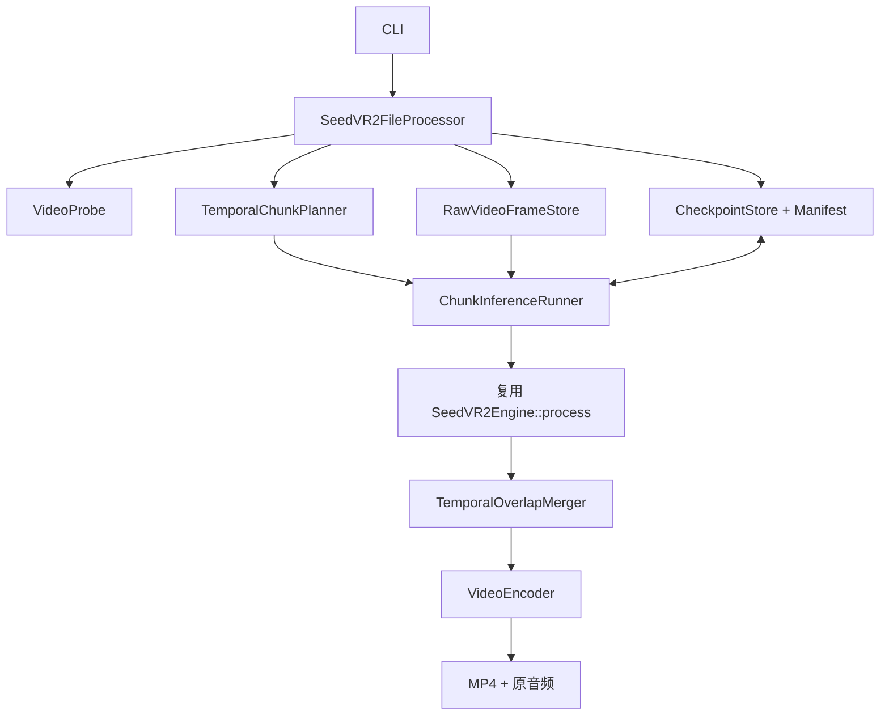

# SeedVR2 NCNN Vulkan 项目结构与长视频开发接手指南

> 本文基于 `main` 当前实现，供后续开发者快速确认已完成能力、现有限制和长视频开发路线。

## 1. 当前结论

项目已经打通 Linux/WSL2 NVIDIA Vulkan 上的短视频闭环：

```text
MP4 -> ffmpeg 解码 -> 预处理 -> VAE Encoder -> DiT/CFG/Euler
    -> VAE Decoder -> 后处理 -> ffmpeg 编码及音频 -> MP4
```

当前还不支持真正的长视频。CLI、公开 `Video` 和后处理均让整段视频驻留宿主内存，VAE/DiT 也一次处理完整时间轴。长视频的首要工作是建立**有界内存、可恢复、可验证的时序分块流水线**，不是继续优化单个 shader。

## 2. 接手阅读顺序

1. `agent.md`：编码、测试、注释和 Git 约束。
2. `README.md`：构建、模型、CLI 用法与公开限制。
3. `include/seedvr2/engine.h`：唯一稳定公开 API。
4. `src/core/engine.cpp`：CPU/Vulkan 完整推理编排。
5. `src/cli/main.cpp`：当前整段 MP4 解码和编码。
6. `src/pipeline/preprocessing.cpp`、`postprocessing.cpp`：尺寸、布局与补帧语义。
7. 本文第 8 节的开发顺序。

修改前建立基线：

```bash
git status --short
cmake --build build -j"$(nproc)"
ctest --test-dir build --output-on-failure
```

完整模型测试必须在有模型权重的 NVIDIA Vulkan 主机执行；普通 CI 只做构建和轻量测试。权重、构建目录和测试输出不能进入 Git。

## 3. 目录与模块职责

| 路径 | 当前职责 | 长视频关系 |
|---|---|---|
| `include/seedvr2/engine.h` | `Engine`、运行选项、内存视频与 embedding | 保留短视频接口，不引入 ffmpeg/checkpoint |
| `src/core/engine.cpp` | 预处理、VAE、DiT、sampler、后处理总调度 | 每个短块复用这套推理，不重复加载模型 |
| `src/core/runtime_context.h` | CPU/Vulkan 设备与运行配置 | 所有块共享同一设备生命周期 |
| `src/core/vulkan_context.cpp` | Vulkan allocator、pipeline 和命令环境 | 块间复用资源，块后释放激活 |
| `src/model/vae.*` | 动态 T/H/W 的 encode/decode | 每块独立编码解码；decode 是主要单块耗时之一 |
| `src/model/dit.*` | input head、32 blocks、output head | resident/streaming 两种权重模式 |
| `src/model/sampler.*` | 条件、CFG、Euler | Vulkan `VkMat` 路径已存在 |
| `src/pipeline/preprocessing.*` | THWC->CTHW、中心裁剪、`4n+1` 补帧 | 全局裁剪必须一致，尾块补帧不得进入输出 |
| `src/pipeline/postprocessing.*` | 裁帧、限幅、CTHW->THWC | 后续改为逐块/逐帧输出 |
| `src/layers/` | 六类自定义层 CPU/Vulkan 实现 | 长视频通常不需要新增模型层 |
| `src/cli/main.cpp` | 参数、ffprobe、ffmpeg、Engine 调用 | 长视频改造的主要入口，应拆分媒体组件 |
| `tests/` | 层、VAE、DiT、sampler、运行时测试 | 增加 planner、融合、恢复和集成测试 |
| `docs/custom_layers/` | 自定义层设计与验证报告 | 排查算子问题的第一入口 |
| `docs/v2.0开发优化/` | 只记录已验证并提速的优化 | 长视频功能设计不放这里 |

## 4. 现有逻辑结构

### 4.1 CLI 为什么不能处理长视频

`src/cli/main.cpp` 当前流程：

1. `ffprobe` 读取宽、高、帧率。
2. `decode_frames()` 将全部 RGB24 帧放入一个 `vector`。
3. 再创建整段 THWC FP32 `Video::data`。
4. `Engine::process()` 一次处理全部帧。
5. 再创建完整 FP32/RGB8 输出并一次编码。

运行期间可能同时存在 RGB8 输入、FP32 输入、模型激活、FP32 输出和 RGB8 输出。因此即使显存够用，一分钟 480p 的宿主内存也会随总帧数增长。

### 4.2 Engine 模型语义


必须保持的预处理语义：

- 宽高中心裁剪到 16 的整数倍，不偷偷缩放。
- 多帧输入满足 `4n+1`；不足时复制末帧，输出时裁掉。
- 所有时间块必须使用相同的空间裁剪参数。

### 4.3 当前 Vulkan 优化状态

当前 Vulkan 路径已经完成大数据 `VkMat` 串联：

- 入口集中上传预处理视频、随机数和文本。
- VAE Encoder、条件构造、DiT、CFG/Euler、VAE Decoder 之间的大张量保持为 `VkMat`。
- DiT input head、32 blocks、output head 不通过 CPU `Mat` 串联。
- shape/timestep 使用 CPU 运行时元数据，不下载 feature tensor。
- 最终 decoded video 才下载到 CPU 后处理。

因此长视频不需要重新解决 DiT Mat/VkMat 往返；需要让有限长度时间块依次进入现有 Vulkan 流水线，并及时消费输出。

## 5. 已完成能力与优化

- 动态尺寸 VAE Encoder/Decoder 已转换为 NCNN param/bin。
- DiT input head、32 blocks、output head 已转换并可完整执行。
- 六类自定义层有 CPU/Vulkan 实现和独立中文报告。
- CFG 与 Euler sampler 有 Vulkan 实现。
- Window attention 已修复为仅视频 Q/K 做 3D RoPE，文本 Q/K 不做 RoPE，并统一 QK Norm、BF16 边界和窗口语义。
- DiT 支持 resident 与 streaming；前者速度优先，后者显存优先。
- Convolution3D Vulkan 已完成多输出通道、权重 pack4/vector load 和工作组调优，详见 `docs/v2.0开发优化/VAE_3D卷积优化详解.md`。
- 真实 MP4 短视频闭环已经存在。

仍可继续研究 VAE 主激活 pack4，减少动态 GroupNorm、SpatialAttention、SpaceTimeShuffle 前后的 pack/unpack。但它是长视频功能完成后的性能任务。新增块尺寸也仍需单独做 PyTorch/CPU/Vulkan 验证，不能把既有测试结论无限外推。

## 6. 长视频能力缺口

| 缺失 | 影响 | 目标 |
|---|---|---|
| 时序 planner | 全帧进入模型 | 固定块长并正确补尾帧 |
| 流式输入 | 整段 RGB8/FP32 常驻 | raw 帧缓存或有界 ring buffer |
| overlap merger | 硬拼会闪烁 | raised-cosine 融合 |
| 流式输出 | 输出随帧数增长 | 确定帧立即编码 |
| checkpoint | 中断后从头计算 | 块级原子保存 |
| resume 校验 | 可能混用旧结果 | 输入、模型、参数和 payload SHA256 |
| 确定性噪声 | 恢复结果可能变化 | base seed + 全局块起点稳定派生 |
| 音频恢复闭环 | 编码中断处理不完整 | 帧率、音频、时长保持一致 |
| 长时测试 | 无内存稳定性证据 | 一分钟 480p 验收 |

## 7. 推荐目标架构

`SeedVR2Engine` 继续只负责内存短块推理。文件系统、ffmpeg、checkpoint 和恢复属于应用层：



组件职责：

- `VideoProbe`：尺寸、帧数、帧率、时长和音频信息。
- `RawVideoFrameStore`：顺序解码到 RGB24 raw，按帧号定长读取。
- `TemporalChunkPlanner`：块起点、有效帧、padding 和左右 overlap。
- `ChunkInferenceRunner`：构造短 `Video` 并调用同一个已加载 Engine。
- `TemporalOverlapMerger`：权重累加、归一化，只保留未确定的尾部帧。
- `CheckpointStore`：原子写块结果并严格校验恢复条件。
- `VideoEncoder`：持续接收已确定帧，最终处理原音频。
- `SeedVR2FileProcessor`：只负责编排和阶段化错误。

建议接口：

```cpp
struct LongVideoOptions
{
    int chunk_frames = 17;
    int overlap_frames = 5;
    std::string work_dir;
    bool resume = false;
    bool keep_work_dir = false;
};

class SeedVR2FileProcessor
{
public:
    int process_file(const std::string& input_path,
                     const std::string& output_path,
                     const LongVideoOptions& options);
};
```

不要让每块重新加载约 7GB 模型，也不要让核心 Engine 直接依赖 shell 或 ffmpeg。

## 8. 分块与融合语义

第一版推荐：

```text
chunk_frames = 17       # 满足 4n+1
overlap_frames = 5      # 满足 4m+1，且小于块长
stride = 12
starts = 0, 12, 24, 36, ...
```

规则：

- 17 帧及以下保持原整段路径。
- 尾块不足 17 帧时复制全局最后一帧补齐，推理后裁掉 padding。
- `chunk_frames=0` 可显式关闭分块。
- 17/5 是初始折中：更长块上下文更好但显存更高；更大重叠接缝更弱但重复计算更多。

重叠区禁止覆盖或硬切，使用 raised-cosine：

```text
pixel_sum += chunk_pixel * weight
weight_sum += weight
final_pixel = pixel_sum / weight_sum
```

第一块无左渐入，最后一块无右渐出，中间块首尾渐入/渐出。权重归一化后每个有效位置之和必须为 1。

融合器不能持有完整输出。按起点递增执行时，未来块只能影响当前尾部 overlap；再也不会被覆盖的帧必须立即 flush 给编码器。

时间分块是近似语义，不等于完整时间轴逐元素推理：每块上下文有限，重叠帧由多个独立预测融合，VAE/DiT 时间边界会重复出现。验收目标应是结果稳定、无明显接缝、可恢复，而不是声称逐元素等价。

## 9. 输入缓存与断点恢复

### 9.1 输入方案选择

| 方案 | 优点 | 缺点 | 选择 |
|---|---|---|---|
| ffmpeg pipe/ring buffer | 少占磁盘 | 中断恢复复杂 | 后续低磁盘模式 |
| 单个 RGB24 raw 缓存 | 帧偏移精确、恢复简单 | 需要数 GB 临时空间 | 第一版推荐 |
| 每块 ffmpeg seek | 表面简单 | 关键帧/时间戳导致重叠输入不稳定 | 不采用 |

raw 帧偏移固定为 `frame_index * width * height * 3`。输入缓存先写 `.part`，完成并校验后原子重命名。推理前估算 raw、FP16 checkpoint、最终视频和至少 20% 余量，空间不足应立即失败。

### 9.2 工作目录与 checkpoint

```text
<output>.seedvr2-work/
├── manifest.json
├── input.rgb24
├── input.rgb24.sha256
└── chunks/
    ├── chunk_000000.f16
    └── ...
```

块输出推荐 FP16 存盘、FP32 融合。每个块 header 包含：magic/version、chunk index、global start、valid frames、W/H/C、payload bytes 和 SHA256。

提交顺序：写 `.part`、flush/close、计算 hash、原子 rename、最后原子更新 manifest。半成品不能被标记完成。

manifest 至少记录：

- 输入 SHA256、尺寸、裁剪尺寸、FPS、帧数、时长和音频。
- 模型 manifest/hash。
- steps、CFG、condition noise、VAE 参数和 base seed。
- chunk/overlap/stride、融合算法版本。
- 各块 header、大小和 SHA256。
- 程序与 checkpoint 格式版本。

`--resume` 必须逐项校验。输入、模型或任一影响结果的参数变化时拒绝恢复；损坏块只重算该块。最终编码中断后应只重新融合/编码，不重复已完成模型块。未指定 `--resume` 且工作目录存在时不能自动覆盖。

### 9.3 确定性随机数

使用固定、跨平台整数 hash（例如 SplitMix64）派生块 seed：

```text
chunk_seed = stable_hash(base_seed, global_start_frame)
```

不要使用跨实现不保证一致的 `std::hash`。算法变化时提升 manifest 版本，保证连续运行和恢复运行对同一块产生相同随机序列。

## 10. 小步开发顺序

每个阶段独立测试、独立中文提交。不要一次同时修改 planner、媒体 IO、恢复和 shader。

### 阶段 0：锁定短视频基线

- 保存 5 帧 320x240、480x270 的输出元数据、误差和耗时。
- 运行现有 CTest、VAE、DiT 与 Vulkan 边界测试。
- 记录 GPU/驱动/Vulkan/NCNN commit/模型 hash/命令。

完成标准：短视频行为可重复，后续改造不得破坏。

### 阶段 1：纯逻辑 Planner

- 实现 start、valid count、padding、left/right overlap。
- 测试 1、5、17、18、29、41、65 帧。
- 验证无遗漏、无越界和尾块补帧正确。

建议提交：`feat(long-video): 增加确定性时序分块规划器`

### 阶段 2：纯逻辑流式 Merger

- 实现 raised-cosine 权重与 flush。
- 用常量、线性坡度、脉冲信号验证。
- 证明缓存量只由 chunk/overlap 决定，与总帧数无关。

建议提交：`feat(long-video): 增加流式重叠融合器`

### 阶段 3：内存视频真实分块推理

- 长输入逐块构造短 `Video`，所有块复用同一 Engine。
- 先把融合结果留在内存，快速验证模型语义。
- 5/17 帧走旧路径，输出不得变化。

建议提交：`feat(engine): 接入长视频时序分块推理`

### 阶段 4：磁盘输入与流式编码

- ffprobe 获取帧数、时长和音频。
- 顺序生成并校验 `input.rgb24`。
- 每次只加载当前块并转 FP32。
- 已确定帧立即写入持续运行的 ffmpeg 编码器。

建议提交：`feat(cli): 增加有界内存长视频媒体流水线`

### 阶段 5：Checkpoint/Resume

- 实现版本化 manifest、header、`.part` 和 SHA256。
- 增加 `--work-dir`、`--resume`、`--keep-work-dir`。
- 测试第 3 块退出、checkpoint 损坏和编码中断。

建议提交：`feat(cli): 增加块级检查点与断点恢复`

### 阶段 6：一分钟 480p 验收

- 先跑 41 帧带音频视频。
- 再跑一分钟 480p，并中断恢复一次。
- 记录 host RAM、VRAM、临时磁盘、每块/总耗时和边界帧质量。

建议提交：`docs(long-video): 记录一分钟视频验收结果`

### 阶段 7：闭环后的性能优化

按 profile 选择：复用 Vulkan buffer/allocator、自动 resident 策略、VAE 激活 pack4、低磁盘 ring-buffer。涉及跨块上下文复用时必须重新验证语义。只有实际提速且精度通过的内容才写入 `docs/v2.0开发优化/`。

## 11. 测试与验收

单元测试：

- Planner 覆盖短片、完整块、尾块和多块。
- 拒绝非法 `4n+1`、overlap 大于等于块长等参数。
- Fusion 权重和为 1，常量不变，线性信号无额外跳变。
- padding 不进入最终输出。
- 相同块 seed 跨运行一致，不同起点不重复。
- 截断、错误 hash/尺寸/参数/版本的 checkpoint 均被拒绝。

集成与真实视频验收：

- 5、17 帧不分块并保持当前输出。
- 18、29、41、65 帧覆盖尾块和重叠。
- 第 3 块中断恢复与连续运行的最终 payload hash 一致。
- 编码中断恢复不重新执行完成块。
- 输出帧数/FPS 与输入一致，音频存在，时长误差不超过一帧。
- 无 NaN/Inf，像素范围合法，边界无肉眼可见闪烁。
- 81 帧 host RAM 不应接近 41 帧的两倍；一分钟任务内存形成平台期。
- CPU 轻量测试和 RTX 5090 Vulkan 完整测试都通过。

## 12. 常见错误方向

1. 外层切块但把所有块输出存在一个 vector：输出内存仍随视频增长。
2. 每块单独 ffmpeg seek：重叠输入可能因关键帧/时间戳不一致。
3. 每块重载 Engine：反复读取和上传大模型。
4. 重叠帧覆盖或硬切：产生接缝且结果依赖执行顺序。
5. checkpoint 只记完成编号：无法发现参数混用或 payload 损坏。
6. 把 ffmpeg/checkpoint 放进 Engine：污染稳定核心 API。
7. 先做 pack4 再做分块：单块更快不解决内存无限增长。
8. 宣称分块等价整段推理：模型上下文和边界条件决定它只能是近似。

## 13. 建议新增文件

```text
include/seedvr2/file_processor.h
src/long_video/temporal_chunk_planner.h/.cpp
src/long_video/temporal_overlap_merger.h/.cpp
src/long_video/checkpoint_store.h/.cpp
src/long_video/raw_video_frame_store.h/.cpp
src/long_video/file_processor.cpp
src/cli/video_probe.h/.cpp
src/cli/video_encoder.h/.cpp
tests/temporal_chunk_planner_test.cpp
tests/temporal_overlap_merger_test.cpp
tests/checkpoint_store_test.cpp
tests/long_video_integration_test.cpp
```

若要求核心静态库不依赖 ffmpeg，可让 probe/store/encoder 留在 CLI support library，planner、merger 和 checkpoint 格式放内部库。第一版不需要插件系统。

## 14. 交接结论

模型转换、短视频闭环、自定义 Vulkan 层和 Engine 内部大型张量 `VkMat` 数据流均可直接复用。长视频不需要推倒 VAE/DiT，也不需要先新增算子。

下一位开发者应从 `TemporalChunkPlanner` 开始，再做流式 merger、真实模型分块、磁盘输入、checkpoint/resume 和音频。最终完成标准是：**一分钟 480p 在固定内存上可中断恢复地完成推理**，而不是让一个更长的整段 `Video` 偶然不 OOM。
