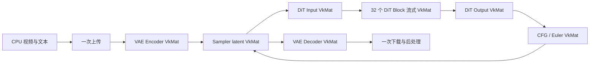

# SeedVR2 NCNN Vulkan 算子开发与验证方案

> 本文件定义 SeedVR2 NCNN 从已验证 CPU 版本推进到 Vulkan 推理版本的完整路线。
> 目标不仅是“能在 GPU 上运行”，还要形成可解释、可测试、可分析性能，适合学习和
> 面试讲解的工程实现。本文是开发前的设计基线，不表示 Vulkan 算子已经完成。

## 1. 结论与准确范围

当前 Vulkan 化的核心工作确实是：

1. 为六种自定义层补齐 GPU 路径；
2. 解决 VAE 中 `Convolution3D` 没有可用 Vulkan 实现的问题；
3. 重构 DiT 调度，使中间张量持续保留在 `VkMat` 中，而不是每个 block 都回传 CPU；
4. 建立从 primitive、算子、子图、完整 VAE/DiT 到视频结果的逐级验证体系。

“六类”是六个 C++ 层类型，不是每个模型实例各写一套 shader。例如，
`DynamicFramewiseGroupNorm` 在模型中出现约 50 次，但只维护一套 Vulkan 实现和若干
精度/packing pipeline；32 个 `SeedVR2DiTBlock` 也共享同一份层实现。

如果保持当前 `.param/.bin` 图结构，并要求全程 GPU 推理，六种类型都必须具备 Vulkan
路径。但这不等于六种类型都要从零实现所有计算：

- 线性层、RMSNorm、Softmax 等应优先复用 ncnn 原生 Vulkan 层；
- 动态索引、窗口组织、MM-RoPE3D、时空重排才写自定义 shader；
- 也可以重导模型，把一个大自定义层拆成原生层和更小的自定义层；
- CPU fallback 只能调试，不能作为最终“完整 Vulkan 推理”的验收结果，因为它会造成
  GPU/CPU 同步和大张量上传下载。

### 1.1 第一阶段边界

- 不改变 PyTorch 语义，不重新训练；
- batch=1，与当前 CPU 基线一致；
- 文本 embedding 在图外预计算；
- 先 FP32、pack1 正确，再做 FP16、packing 和融合；
- 先支持 RTX 5090，不承诺第一版在所有 GPU 上性能一致；
- 当前只制定方案，后续按阶段独立实现、测试和提交。

## 2. 当前基线

### 2.1 已有资产

| 资产 | 状态 | Vulkan 阶段用途 |
| --- | --- | --- |
| 动态 VAE Encoder/Decoder | CPU 已通过两组随机动态尺寸 | 同权重 GPU oracle |
| DiT input、32 blocks、output | CPU 已逐层及串联验证 | block GPU 基线 |
| 六类 CPU 自定义层 | 已实现 | shader 语义规范 |
| 两个真实视频 reference | 有 PyTorch 中间结果 | 第三方 oracle |
| `tests/*_runner.cpp` | 有分层入口 | 扩展 CPU/Vulkan 双后端 |
| `SeedVR2Engine` 等封装 | 有基础结构 | 增加 VkMat 生命周期 |

已知数值基线：

- 动态 VAE CPU 对 PyTorch：四项 `max_abs < 8.5e-5`；
- 单个 DiT block 的 64 次验证：最坏 `NRMSE < 0.00144`；
- 32 blocks 串联：两个示例 `NRMSE` 约 `0.0170`、`0.0123`，cosine 约
  `0.999855`、`0.999924`；
- 完整 DiT 基线包含 FP16 来源权重、BF16 边界舍入和不同 GEMM/SDPA 的累计误差。

所以 Vulkan 必须同时比较：

```text
同一 NCNN 权重：Vulkan vs NCNN CPU
同一模型语义：Vulkan vs PyTorch reference
```

第一项隔离 Vulkan 新增误差，第二项避免跟随错误的 CPU 实现。

### 2.2 代码现状

`SEEDVR2_ENABLE_VULKAN` 已存在，但 `SEEDVR2_CUSTOM_LAYERS_VULKAN=0` 会主动拒绝
Vulkan。这是正确保护，不应在第一层完成时直接打开。应先按层注册能力，完整路径验收后
才允许 `SeedVR2Engine(DeviceType::Vulkan)`。

当前 `SeedVR2DiT::forward` 使用 `ncnn::Mat`，每个 block 创建一个 `Net`。即使层本身有
Vulkan 实现，block 边界也可能下载、同步和重新上传。最终必须增加 `VkMat` 串联：输入上传
一次，32 个 block 之间只传 GPU blob，进入最终后处理时才下载。

### 2.3 当前 WSL 不是有效的 NVIDIA Vulkan 环境

当前探测为：

```text
nvidia-smi: NVIDIA GeForce RTX 5060 Laptop GPU, 8151 MiB
vulkaninfo: llvmpipe，vendorID=0x10005，deviceType=CPU
```

这表示 CUDA 管理接口可见，但 Vulkan loader 只枚举到 Mesa 软件 CPU。这里可编译 shader
和跑 CPU 测试，不能作为 NVIDIA Vulkan 验证。硬性门槛是 `vulkaninfo --summary` 枚举出
NVIDIA 物理设备，通常 `vendorID=0x10de`，且 `ncnn::get_gpu_count() > 0`。

RTX 5090 本身足够：官方规格为 32 GB 显存并支持 Vulkan 1.4。实际限制是 ICD/驱动、
权重驻留策略和 attention workspace。32 GB 也不能无边界物化所有窗口的注意力矩阵。

## 3. 完成标准

### 3.1 功能标准

- 六类自定义层都有 GPU 路径，或被等价原生 Vulkan 子图替代；
- VAE 的全部 `Convolution3D` 在 GPU 执行；
- VAE Encoder/Decoder、DiT input/32 blocks/output 可串联；
- CFG、Euler 和 VAE decode 主数据流没有隐式 CPU tensor fallback；
- 支持约束内的动态 `T/H/W`，不是只支持两个示例；
- CPU 后端永久保留为回归基线；
- 非法 shape、显存不足、无 Vulkan 设备时返回明确错误。

### 3.2 精度标准

每项测试记录 shape、finite、`max_abs`、`mean_abs`、RMSE、NRMSE、cosine。

| 类型 | FP32 Vulkan 对 NCNN CPU 建议初始阈值 |
| --- | ---: |
| 纯索引/重排 | bit exact 或 `max_abs <= 1e-6` |
| elementwise/Linear 编排 | `max_abs <= 1e-4` |
| norm/reduction | `max_abs <= 5e-4` |
| 单次 attention/block | `NRMSE <= 1e-3` 且 `cosine >= 0.99999` |
| 完整 32 blocks | GPU 对 CPU 的新增 `NRMSE <= 2e-3` |

FP16 不直接套 FP32 阈值。建议对 PyTorch 的完整 DiT `NRMSE` 不比现有 CPU 基线恶化
超过 10%，或绝对增加不超过 `0.002`，取更严格者；cosine 降低不超过 `1e-5`。
第一次可复现测量后固定阈值，后续不能为通过测试临时放宽。

### 3.3 性能标准

第一版 correctness 不设激进速度目标，但必须记录：

- shader、子阶段、block、VAE stage 和单 sampling step 时间；
- 权重上传、command submit 和同步耗时；
- 峰值显存、workspace、block cache；
- FP32、FP16 storage、FP16 arithmetic 三种配置；
- warm-up 后至少 10 次，报告 median 和 P90，不只报告最快值。

## 4. Vulkan 开发所需基础知识

### 4.1 GPU 执行模型

- SIMT、warp/subgroup、workgroup、local/global invocation ID；
- 连续/合并访存、对齐、stride 和 cache locality；
- occupancy、寄存器压力、shared memory；
- 分支发散，特别是窗口和 causal 边界；
- 树形归约、subgroup reduction 及数值顺序；
- 算术强度、带宽受限与计算受限。

学习验收：能从 `[C,T,H,W]` 的地址公式说明相邻 invocation 的访问；能解释为什么
attention logits 物化会成为显存瓶颈。

### 4.2 Vulkan Compute

- instance、physical/logical device、compute queue；
- buffer、device memory、staging；
- descriptor、binding、pipeline layout、compute pipeline；
- GLSL compute 到 SPIR-V；
- push constant 与 specialization constant；
- command buffer record/submit；
- pipeline barrier、memory dependency、fence/semaphore；
- validation layer 和 debug messenger。

项目使用 ncnn 封装，不必从零封装 Vulkan，但必须理解 `VkCompute::record_pipeline`
最终做了什么，才能定位 binding、数据竞争和多余同步。

### 4.3 GLSL 与数值

- `shared` memory、`barrier()`、subgroup 操作；
- FP32/FP16/BF16 的范围、精度和舍入；
- 稳定 softmax：减 row max 后求指数；
- online softmax 的运行 max/sum 和输出重标定；
- Welford variance 与 `E[x²]-E[x]²`；
- FP16 storage + FP32 accumulation；
- NaN/Inf 和极值输入测试。

### 4.4 ncnn Vulkan 层生命周期

1. 构造函数声明 `support_vulkan`、packing 能力；
2. `load_param/load_model` 读取配置和 CPU 权重；
3. `upload_model` 上传常驻权重为 `VkMat`；
4. `create_pipeline` 按 shape、精度、packing 建 pipeline；
5. `forward/forward_inplace` 分配 workspace、记录 dispatch；
6. `destroy_pipeline` 释放 pipeline；
7. 运行时统一管理 allocator 和 command 生命周期。

优先阅读本地 ncnn 的 `GroupNorm_vulkan`、`RMSNorm_vulkan`、`InnerProduct_vulkan`、
`Softmax_vulkan` 和卷积实现。要画清 shader binding、push constant、specialization、
输出 shape 和 dispatch grid，而不是复制后改名。

### 4.5 模型算法与工具

必须能推导 GroupNorm、RMSNorm、GEMM、softmax attention、RoPE、SwiGLU、patchify、
shuffle 和 3D convolution。DiT 还要理解 Ada shift/scale/gate、视频窗口与文本融合、
shifted window、MM-RoPE3D、权重共享及 block 31 特例。

工具：Vulkan validation layer、ncnn benchmark/log、RenderDoc、NVIDIA Nsight Systems、
Nsight Compute/Graphics 和 `nvidia-smi`。`nvidia-smi` 只能粗看显存/利用率，不能替代 GPU
timestamp 和 profiler。

## 5. 总体架构

### 5.1 双后端同语义

```text
param/bin
   +-- load_param/load_model ---------- shared state
   +-- CPU forward(Mat) --------------- correctness oracle
   +-- upload_model/create_pipeline
           +-- Vulkan forward(VkMat) -- production path
```

CPU 实现不能删除，它是跨 GPU、驱动和优化版本定位误差的永久基线。

### 5.2 三层结构

1. 语义层：六个 ncnn custom Layer，负责参数、shape、错误检查；
2. GPU primitive：patch、reduction、RoPE、window gather/scatter、shuffle、online softmax；
3. 调度层：VAE/DiT/Engine 管理 `VkMat`、allocator、command、权重驻留和同步。

避免把所有逻辑塞进巨型 shader。可独立测试的 primitive 对学习、调试、复用和面试讲解
都更有价值。

### 5.3 数据流



关键不是设置 `use_vulkan_compute=true`，而是 block 间不出现 `VkMat -> Mat -> VkMat`。
3 个整数的 shape metadata 可以留 CPU，大 tensor 必须留 GPU。

## 6. 六类自定义层的方案选择

### 6.1 DynamicSpaceTimeShuffle

```text
input  [Cin,T,H,W]
output [Cout,rt*T-1,2H,2W]  (rt=2)
output [Cout,T,2H,2W]       (rt=1)
```

| 方案 | 优点 | 缺点 |
| --- | --- | --- |
| A，推荐第一版：原生 GPU GEMM + 自定义 shuffle | 大计算复用成熟实现；重排可 bit-exact | 一个中间 VkMat 和额外 dispatch |
| B：projection+shuffle 融合 | 少中间写回 | 地址与大投影耦合，难调优/复用 |
| C：重导原生组合图 | 自定义代码可能更少 | 动态 `2T-1` 和删除 raw frame 1 仍难表达 |

推荐 A，并作为第一个 Vulkan 算子：索引确定，能打通 shader 构建、binding、dispatch、
VkMat 和测试设施。

### 6.2 DynamicFramewiseGroupNorm

每个 `(frame, group)` 只统计该帧该组内 `C/G*H*W`。

| 方案 | 优点 | 缺点 |
| --- | --- | --- |
| A，推荐最终：自定义多 pass reduction + normalize | 语义精确，workspace 可控 | 要处理归约、同步和精度 |
| B：reshape 后复用原生 GroupNorm | 开发量小 | ncnn 无通用 batch 维，可能无法无拷贝保持统计轴 |
| C：每帧调用一次原生 GroupNorm | 直观 | T 次 dispatch 和切片，T 大时慢 |
| D：CPU fallback | 调试快 | 不是最终解 |

先写最小 probe 验证 B；若不能无拷贝表达，立即选 A。A 分 partial sum/square、group finalize、
normalize 三个 pipeline，FP32 accumulation。

### 6.3 SeedVR2DiTInput

| 方案 | 优点 | 缺点 |
| --- | --- | --- |
| A，推荐：patchify/timestep 小 shader + 5 个原生 InnerProduct | 清晰、可逐节点对齐 | 多个 dispatch |
| B：重导多个原生层，只留 patchify | 图更可观察 | 重做模型和回归，动态 shape 仍需处理 |
| C：全融合 | dispatch 少 | 权重大、寄存器压力高、难调试 |

推荐 A。`patched_shape` 可为 CPU 小元数据；视频、文本和 embedding 必须留 GPU。

### 6.4 SeedVR2DiTOutput

| 方案 | 优点 | 缺点 |
| --- | --- | --- |
| A，推荐：原生 RMSNorm/InnerProduct + Ada/unpatch shader | 可复用、可观察 | 多次 dispatch |
| B：融合 RMSNorm/Ada | 少一次中间存储 | reduction+affine 更复杂 |
| C：全融合 | 理论 dispatch 最少 | Linear 权重读取主导，性价比低 |

先选 A；profiling 证明 RMSNorm/Ada 是瓶颈后再考虑 B。

### 6.5 DynamicFramewiseSpatialAttention

VAE bottleneck 对每帧 `N=H*W` token 做单头 attention，帧之间不可见。

| 方案 | 优点 | 缺点 | 阶段 |
| --- | --- | --- | --- |
| A：组合 norm/Linear/Softmax/GEMM | 最易分段对齐 | 物化 `[N,N]`，显存 O(N²) | 小尺寸 oracle |
| B：每帧调用原生 SDPA | 复用 attention 核心 | 需确认本地 ncnn 接口/layout；多 dispatch | 第一版候选 |
| C，推荐优化：tiled online-softmax | 不物化 logits，显存可控 | 最难实现和验证 | 正确后优化 |
| D：帧 bucket 批量 attention | 减 dispatch | 必须用块对角 mask 保证不跨帧 | 后续优化 |

先在 A/B 中选一个 correctness 路径，再做 C。A 不能作为任意高分辨率正式方案。若本地
ncnn SDPA 能匹配“单头、逐帧、scale=1/sqrt(C)”，优先 B，否则 A 仅作小尺寸 oracle。

### 6.6 SeedVR2DiTBlock

它包括 Ada、RMSNorm、QKV、Q/K norm、动态窗口、shift、MM-RoPE3D、视频/文本联合
varlen attention、输出投影、SwiGLU 和残差，是最后实现且最复杂的一层。

外层方案：

| 方案 | 优点 | 缺点 | 结论 |
| --- | --- | --- | --- |
| A：保持一个 block，内部组合原生 primitive + 小 shader | 不改模型，权重边界稳定 | 层内调度多 | **推荐** |
| B：重导成很多小层 | graph 可观察 | 改 32 份图，窗口元数据传播复杂 | 后续可考虑 |
| C：巨型融合 shader | 潜在流量最低 | 难调试、寄存器压力和变体多 | 第一版不做 |

attention 核心：

| 方案 | 显存 | 难度 | 用途 |
| --- | ---: | ---: | --- |
| 物化 logits + Softmax + V | O(sum Lw²) | 低 | correctness |
| 每窗口原生 SDPA | 取决于实现 | 中 | 第一版候选 |
| 同尺寸 window bucket + SDPA | 可控 | 中/高 | 优化 |
| tiled online softmax | 不物化完整 logits | 高 | 最终目标 |

窗口索引方案：

| 方案 | 优点 | 缺点 |
| --- | --- | --- |
| A，推荐：CPU 生成紧凑 index/offset，上传小 metadata | 易验证，可按 shape 缓存 | 一次小上传 |
| B：GPU 生成 | 无 CPU 规划 | 多阶段、调试和同步复杂 |
| C：padding 到统一窗口 | 规则地址、便于 bucket | 无效计算和复杂 mask |

推荐 A，按 `(shape, block index, shifted, text length)` cache。只有 profiler 证明 planning
是瓶颈时才做 B/C。

必须专项验证 block 0、9、10、31；偶数和 shifted window；0-9 独立权重、10-31 shared
weights；文本 varlen offsets；MM-RoPE3D；BF16 边界；block 31 `vid_only`；Ada slot。

## 7. VAE Convolution3D 方案

模型约有 62 个实例，本地 ncnn 没有对应 Vulkan 类。因果性不在卷积权重或 mask 中：当前
图先用 `Padding/Crop/Concat` 复制/补齐历史帧，再执行普通 3D 卷积。因此 GPU Conv3D
只复现普通卷积，因果边界由前置图保证。

| 方案 | 优点 | 缺点 |
| --- | --- | --- |
| A，推荐第一版：沿 `kt` 展开为若干 Conv2D Vulkan 后累加 | 复用成熟 Conv2D，易对齐 | dispatch、切片、累加较多 |
| B：实现通用 `Convolution3DVulkan` | 接口干净、可复用、面试价值高 | 覆盖 kernel/stride/pad/group/packing，工作最大 |
| C：按实际参数族写 specialized shader | 容易针对热点优化 | 泛化弱，变体和测试增多 |
| D：为 ncnn 上游贡献通用实现 | 工程与面试价值最高 | 需维护 fork、遵循上游规范、周期长 |

推荐组合：先统计 62 层唯一 `(Cin,Cout,Kt,Kh,Kw,stride,pad,group)`；A 打通完整 VAE；
根据 profiler 用 C 优化热点；B/D 可作为独立高价值目标。如果实际参数族很少，C 的投入产出
可能高于立刻写通用 B。

## 8. 32 Block 权重驻留方案

DiT 约 6.4 GB。不同方案：

| 方案 | 优点 | 缺点 | 使用场景 |
| --- | --- | --- | --- |
| A：全部预上传 | 单 step 最快 | 6.4 GB 加 workspace；移动端不适用 | 5090 性能模式 |
| B：逐 block 上传、运行、释放 | 峰值最低 | 每 step 重传约 6.4 GB，50 step/CFG 很慢 | correctness/低内存 |
| C，推荐架构：N-block LRU/滑动 cache | 显存/传输可配置 | 调度和生命周期复杂 | 正式实现 |
| D：host-visible/统一内存 | 可能少 staging | 独显读主存慢且设备相关 | 不作 5090 主方案 |

顺序是 B 保证低内存正确，A 测速度上限，最后 C。5090 可默认尝试全驻留，但 VAE、workspace、
CFG 和其他进程仍需显存，必须实测。释放 weight allocator 前要确保引用权重的 GPU command
已完成，不能为少 submit 而提前释放。

## 9. 推荐开发顺序与阶段出口

### Phase 0：冻结基线和环境门禁

- 记录 ncnn commit、编译器、SDK、驱动、GPU；
- 统计模型 layer type 和 Conv3D 参数族；
- 固化 CPU JSON、reference、模型 SHA-256；
- Vulkan smoke test：设备枚举、原生 GPU 层上传/执行/下载；
- validation layer 开启时无错误。

出口：真实 NVIDIA device 可见；smoke 连续三次一致；CPU 回归通过。

### Phase 1：双后端测试设施

- runner 支持 `--device cpu|vulkan`、精度、设备编号；
- 同一输入运行 CPU/GPU，统一输出 JSON；
- `VkMat` 上传下载和 allocator RAII；
- GPU timestamp、显存、pipeline 记录；
- 禁止 CPU fallback 的审计日志/断言。

出口：原生 ncnn 层可由同一 runner 做 CPU/GPU 比较，错误定位到 blob。

### Phase 2：纯重排和 elementwise

1. SpaceTimeShuffle 的纯 shuffle；
2. DiT input patchify/timestep basis；
3. DiT output Ada/unpatchify；
4. window gather/scatter primitive。

出口：id/ramp/checkerboard bit-exact；随机动态 shape 达标；validation 无错误。

### Phase 3：FramewiseGroupNorm

- 先 probe 原生 GroupNorm 重用；不适合则自定义 reduction；
- 测小方差、大幅值、常量、非方形；
- FP32 accumulation 后才做 FP16 storage。

出口：覆盖 VAE 实际通道/shape，不只测 toy case。

### Phase 4：DiT Input/Output 完整 GPU 化

- 接入 InnerProduct/RMSNorm Vulkan；
- 完成权重上传和 pipeline 生命周期；
- 子图中保持 VkMat；
- 对齐已有 `.pt` reference。

出口：两个真实案例和至少两组随机 shape 通过，无 tensor 往返 CPU。

### Phase 5：VAE Spatial Attention

- 小尺寸 materialized 或原生 SDPA correctness；
- 证明逐帧不跨帧；
- 记录 H/W 增长下 workspace；
- 决定是否做 tiled online softmax。

出口：帧隔离、数值稳定、正式尺寸显存通过。

### Phase 6：Convolution3D 和完整 VAE

- 参数族统计；
- 用时间展开或 specialized kernel 覆盖全部实例；
- 测普通 padding、causal 前置 padding、stride/downsample；
- 串联 norm/attention/shuffle；
- 跑随机尺寸和两个真实视频 reference。

出口：动态 VAE 达标，62 个实例全走 GPU，无 fallback，有峰值显存报告。

### Phase 7：DiT Block 分段 GPU 化

1. Ada + RMSNorm；
2. QKV/MLP InnerProduct；
3. Q/K per-head norm；
4. window plan 和 gather/scatter；
5. MM-RoPE3D；
6. 单窗口视频 attention；
7. 视频+文本 joint attention/varlen；
8. projection、SwiGLU、gate、residual；
9. block 0/9/10/31；
10. 全 32 blocks。

出口：每个 checkpoint 对齐；64 次独立 block 和 32 block 串联通过。不能跳过中间检查，
只从最终 blob 猜误差来源。

### Phase 8：全引擎 VkMat 流水线

- Engine 上传输入，VAE/DiT/sampler 共享 context/allocator；
- block 间 zero-copy；
- CFG 调度和 block cache budget；
- OOM 错误和失败清理；
- 最终后处理前才下载。

出口：真实视频端到端；profiler 证明无大 tensor fallback；多次处理无泄漏。

### Phase 9：FP16、packing 和性能

按 profiler 依次尝试：FP16 storage、FP16 arithmetic、pack4/8、window bucket、online
softmax、fusion、specialized Conv3D、submit/cache 调优。每次只改变一类优化，并重跑精度、
动态 shape、性能和显存，不能一次打开全部后无法归因。

## 10. 验证体系

### 10.1 四级金字塔

```text
Level 1: GPU primitive（reduction/shuffle/RoPE/gather/softmax）
Level 2: 六个 custom layer + Convolution3D
Level 3: VAE、DiT input/block/output、32 blocks
Level 4: SeedVR2Engine 真实视频
```

Level N 失败先回到 N-1 定位，不能只调最终视频。

### 10.2 每个算子的测试模板

1. 输出 dims/w/h/d/c/elempack；
2. 全零、全一、递增 id、checkerboard；
3. 固定 seed 随机输入；
4. 最小合法、非方形、奇偶、极值；
5. CPU/GPU/PyTorch 三方数值；
6. NaN/Inf；
7. 连续三次确定性；
8. validation layer；
9. 性能和显存；
10. CPU fallback 审计。

### 10.3 动态尺寸

| 类别 | T | H/W 示例 | 目的 |
| --- | --- | --- | --- |
| primitive | 1、2、3 | 2x2、3x5、8x8 | 手工和边界 |
| VAE random | 6、10 | 37x53、41x67 | 复用动态基线 |
| DiT tiny | 1、5、9 | 满足 patch 约束的小尺寸 | 快速和 shifted window |
| example 1 | 5 | 320x240 | 真实基线 |
| example 2 | 5 | 480x256 有效区 | 不同窗口/宽高比 |

“动态 H/W”仍受 patch/downsample 的最小值和整除约束。运行时必须明确 pad/crop，非法输入
报错，不能越界或静默变形。

### 10.4 Attention 专项

- 分别比较 Q/K/V、QK norm、RoPE；
- window index、offset、length 与 PyTorch 一致；
- 单窗口 logits、row max、softmax sum、输出；
- 文本为零/随机/单 token；
- 每帧填不同常数证明 VAE attention 不跨帧；
- shifted/non-shifted；
- online 与 materialized softmax 互为 GPU oracle；
- 大幅值 Q/K 不产生 Inf/NaN。

### 10.5 Convolution3D 专项

- 小通道/kernel 与朴素 CPU 逐元素比较；
- `Kt/Kh/Kw` 为 1 和大于 1；
- stride 1/downsample、bias/no-bias、不同 Cin/Cout；
- 修改未来帧，当前/过去 causal 输出不得变化；
- 每个实际参数族至少一个测试；
- 抽查各 VAE Conv3D blob，不只看 decoder 最终结果。

### 10.6 证明无 CPU fallback

- 层能力表：每个 layer type 的 Vulkan 支持；
- 运行日志：backend 和输入输出 storage；
- profiler：主数据流无大张量上传下载和长 CPU compute。

GPU utilization 大于 0 不能证明全 Vulkan，可能只有原生层在 GPU。

## 11. 环境门禁与构建

```bash
nvidia-smi
vulkaninfo --summary
glslangValidator --version
cmake --version
g++ --version
```

通过条件：5090 和预期驱动；Vulkan physical device 是 NVIDIA 而非 llvmpipe；validation
layer 可用；shader 可编译；ncnn 以 `NCNN_VULKAN=ON` 构建；`get_gpu_count()>0`；最小
GPU inference 数值正确。

```bash
cmake -S . -B build-vulkan \
  -DNCNN_SOURCE_DIR=/path/to/ncnn \
  -DSEEDVR2_ENABLE_VULKAN=ON \
  -DSEEDVR2_BUILD_TESTS=ON \
  -DCMAKE_BUILD_TYPE=RelWithDebInfo

cmake --build build-vulkan -j "$(nproc)"
ctest --test-dir build-vulkan --output-on-failure
```

开发和 profile 用 `RelWithDebInfo`，最终 benchmark 用 `Release`。Debug/validation 的速度
不能作为最终性能报告。

## 12. 代码组织建议

公共 API 继续只暴露 `SeedVR2Engine`，不向用户暴露 Vulkan 类型。内部建议：

```text
custom_layers/
  *.cpp/*.h             Layer 语义与 CPU/Vulkan 入口
  vulkan/               可复用 GPU primitive/pipeline 管理
  shader/               GLSL compute
src/
  vulkan_context.cpp    device、allocator、command、能力
  dit.cpp               Mat/VkMat 双路径、block 调度/cache
  vae.cpp               Encoder/Decoder GPU 串联
  sampler.cpp           CFG/Euler VkMat
tests/
  vulkan_smoke_test.cpp 环境门禁
  *_runner.cpp          CPU/Vulkan 双后端测试
```

实际 shader 目录是否并入 ncnn 的生成机制，在首个原型后决定。原则是 Vulkan 生命周期不泄漏
到公共 API，测试可访问内部组件，shader 按层和阶段命名。

## 13. 每个任务的交付物

按项目 `agent.md`，每个算子必须交付：

- C++/shader，文件头有中文职责说明；
- 重要索引、归约、同步和数值边界有中文注释；
- 单测和动态 shape 测试；
- CPU/Vulkan/PyTorch 对齐 JSON；
- 性能、workspace、峰值显存；
- 独立中文报告：I/O、公式、自定义原因、方案、shader、限制；
- CMake 和复现命令；
- CPU 与 Vulkan 测试通过后再提交。

提交保持单一目的，例如：

```text
feat(vulkan): add exact space-time shuffle kernel
test(vulkan): cover framewise group norm reductions
perf(attention): bucket equal-sized windows
```

不要把六层、运行时重构、FP16 优化塞进一个提交，否则难以 bisect 和讲解。

## 14. 面向学习和面试的重点

最终应能回答：

1. 为什么静态图难表达动态窗口和时空重排？
2. 为什么选 ncnn 自定义层而不是重写框架？
3. 如何保证 CPU、GPU、PyTorch 三方一致？
4. 为什么先 FP32 后 FP16，误差预算如何分层？
5. attention 为什么不能无脑物化 logits？online softmax 如何节省显存？
6. 为什么窗口计划在 CPU，而 tensor 在 GPU？
7. 全驻留、逐 block、LRU cache 如何权衡？
8. causal Conv3D 为什么由 padding 而非 mask 保证？
9. 如何证明没有 CPU fallback？
10. profiler 发现了什么，优化前后 latency/memory/NRMSE 如何变化？

每项优化最终保留 `before/after latency`、`memory`、`NRMSE` 和原因。用数据解释取舍比只
展示大量 shader 更有面试价值。

## 15. 需要选择的决策点

| ID | 决策 | 选项 | 推荐 |
| --- | --- | --- | --- |
| D1 | FramewiseGroupNorm | 原生 reshape probe / 自定义 reduction | probe 失败即自定义 |
| D2 | SpaceTimeShuffle | 分离 / 全融合 | 分离 |
| D3 | VAE attention correctness | 原生 SDPA / 物化 logits | 能精确匹配则原生 |
| D4 | VAE attention 最终 | SDPA / online softmax | profiler 后决定，倾向 online |
| D5 | Conv3D 第一版 | 时间展开 / specialized / 通用 | 时间展开 |
| D6 | Conv3D 长期 | 项目内通用 / ncnn 上游 | 看参数族和周期，面试价值倾向上游 |
| D7 | DiT block 外层 | 组合 primitive / 重导细图 / 巨型融合 | 组合 primitive |
| D8 | window plan | CPU / GPU / padding | CPU 规划并缓存 |
| D9 | DiT 权重 | 全驻留 / 单 block / cache | 先单 block，再可配置 cache |
| D10 | 第一版精度 | FP32 / FP16 | FP32 |

D1/D2/D10 在 Phase 2-3 前决定；D3-D6 在 VAE 阶段；D7-D9 在 DiT block 阶段。
每次选择都写入对应算子报告，并附数据。

## 16. 风险与应对

| 风险 | 后果 | 应对 |
| --- | --- | --- |
| Vulkan 枚举 llvmpipe | 实际测 CPU 软件实现 | Phase 0 检查 vendor/device |
| 总闸门过早开启 | fallback 或失败 | 完整能力表通过后开放 Engine |
| block 间使用 Mat | 频繁上传下载 | VkMat chaining + profiler |
| logits O(N²) | 高分辨率 OOM | 小尺寸 oracle，正式 online softmax |
| FP16 reduction | norm/softmax 误差放大 | FP32 accumulation |
| 权重提前释放 | 随机错/崩溃 | allocator RAII 和 submit 边界 |
| 全驻留挤占 workspace | 5090 也可能 OOM | cache budget、分阶段驻留、测峰值 |
| 只测示例尺寸 | 动态输入失效 | toy/random/真实/T 变化 |
| 只看最终视频 | 无法定位累计误差 | 保存关键 block/attention checkpoint |
| 过早融合 | 难验证、收益不明 | primitive 后由 profiler 驱动 |
| ncnn fork 难维护 | 升级冲突 | 隔离 patch、固定 commit、争取上游 |

## 17. 建议的第一个实现迭代

1. 修复/选择真实 NVIDIA Vulkan 环境；
2. 增加 smoke test 和环境报告；
3. 建立 CPU/Vulkan 统一指标；
4. 实现 SpaceTimeShuffle 中不含 projection 的纯 shuffle shader；
5. id 输入 bit-exact 后接原生 InnerProduct projection；
6. 完成独立报告和 benchmark；
7. CPU 全回归通过后提交。

它能覆盖 shader 构建、VkMat、binding、push constant、动态 shape、pipeline、测试和 Git，
又避开 reduction/attention 的高复杂度，是风险最低且学习密度最高的起点。

## 18. 参考资料

- [ncnn Vulkan notes](https://github.com/Tencent/ncnn/wiki/vulkan-notes)：启用、allocator、
  zero-copy chaining、精度和自定义层生命周期。
- [ncnn Layer support behavior](https://github.com/Tencent/ncnn/wiki/layer-support-behavior)：
  `support_vulkan`、packing 和精度能力。
- [ncnn low-level operation API](https://github.com/Tencent/ncnn/wiki/low-level-operation-api)：
  自定义层内复用原生层。
- [ncnn GLSL extension](https://github.com/Tencent/ncnn/wiki/glsl-extension)：shader 宏、buffer、
  storage 和类型约定。
- [Khronos Vulkan ML synchronization](https://docs.vulkan.org/tutorial/latest/ML_Inference/Vulkan_Compute_for_ML/06_synchronization.html)：
  compute dispatch 的内存依赖和同步。
- [NVIDIA RTX 5090 官方规格](https://www.nvidia.com/en-eu/geforce/graphics-cards/50-series/rtx-5090/)：
  32 GB 显存与 Vulkan 1.4。

仓库语义资料：`docs/custom_layers/overview_zh.md`、六份自定义层专项报告、
`docs/seedvr2_vae_dynamic_ncnn_report_zh.md` 和
`docs/seedvr2_pytorch_to_ncnn_conversion_report_zh.md`。

## 19. 最终推荐路线

```text
真实 NVIDIA Vulkan 环境
 -> 双后端测试框架
 -> SpaceTimeShuffle
 -> FramewiseGroupNorm
 -> DiT Input/Output
 -> VAE SpatialAttention correctness
 -> Conv3D 时间展开
 -> 完整 VAE
 -> DiT Block 分段实现
 -> 32 Block VkMat 串联
 -> 完整 Engine
 -> FP16/packing
 -> online-softmax、window bucket、specialized Conv3D
```

这条路线不把最难的窗口 attention 放在第一个任务，也不为快速看到 GPU utilization 接受
CPU fallback。每一阶段都有可交付、可回归、可讲解的成果，适合将项目建设成完整的模型
部署与 GPU 算子工程案例。
